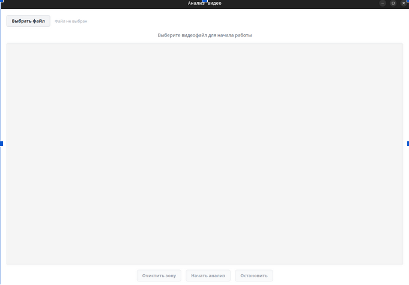
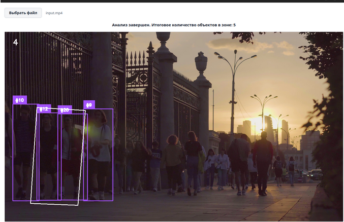
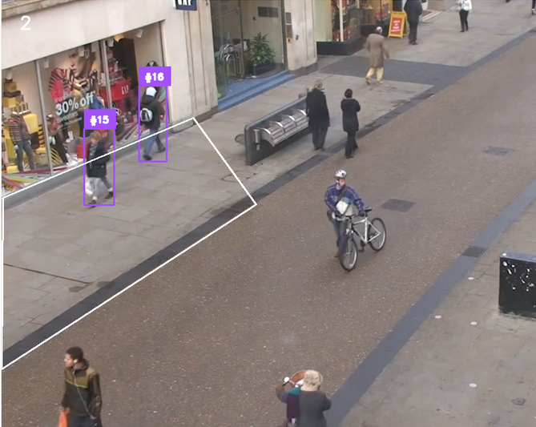

# Анализ видеофайлов и формирование структурированного текстового описания происходящих событий


Приложение для анализа видеопотока, детекции людей и подсчёта объектов внутри выделенной области кадра с использованием модели YOLO.


---

# Возможности

- Детекция людей в видеопотоке
- Подсчёт объектов внутри выделенной зоны
- Поддержка произвольной области подсчёта
- Трекинг объектов с использованием BoT-SORT
- Подсчёт уникальных людей
- Отображение ID объектов
- Работа в режиме реального времени
- Сохранение статистики в CSV
- GUI-интерфейс на PyQt5

---

# Демонстрация

## Главное окно приложения



## Детекция объектов



## Подсчёт людей внутри зоны



---

# Используемые технологии

- Python
- OpenCV
- Ultralytics YOLO
- PyQt5
- NumPy
- Supervision
- PyYAML

---

# Структура проекта

```text
project/
│
├── ui.py
├── video_processor.py
├── requirements.txt
├── people_statistics.csv
├── yolo26n.pt
│
├── assets/
│   ├── main_window.png
│   ├── detection.png
│   └── counting_zone.png
│
└── README.md
```

---

# Установка

## 1. Клонирование репозитория

```bash
git clone https://github.com/qufull/yolo.git

cd yolo
```

---

## 2. Создание виртуального окружения

### Windows

```bash
python -m venv venv

venv\Scripts\activate
```

### Linux / macOS

```bash
python3 -m venv venv

source venv/bin/activate
```

---

## 3. Установка зависимостей

```bash
pip install -r requirements.txt
```

---

# requirements.txt

```txt
opencv-python
numpy
PyQt5
ultralytics
supervision
PyYAML
```

---

# Запуск приложения

```bash
python ui.py
```

---

# Как пользоваться

1. Выберите видеофайл
2. Выделите область подсчёта мышкой
3. Нажмите кнопку запуска
4. Приложение начнёт:
   - обнаруживать людей
   - отслеживать объекты
   - считать людей внутри зоны
   - сохранять статистику

---

# CSV-статистика

Во время обработки автоматически создаётся файл:

```text
people_statistics.csv
```

Пример содержимого:

```csv
Время (сек),Людей в зоне
0.03,1
0.07,1
0.10,2
0.14,3
```

---

# Деплой

## Сборка EXE для Windows

Установка PyInstaller:

```bash
pip install pyinstaller
```

Сборка приложения:

```bash
pyinstaller --onefile --windowed ui.py
```

После сборки `.exe` файл появится в папке:

```text
dist/
```


---

# Автор

Минович Олег Витальевич

